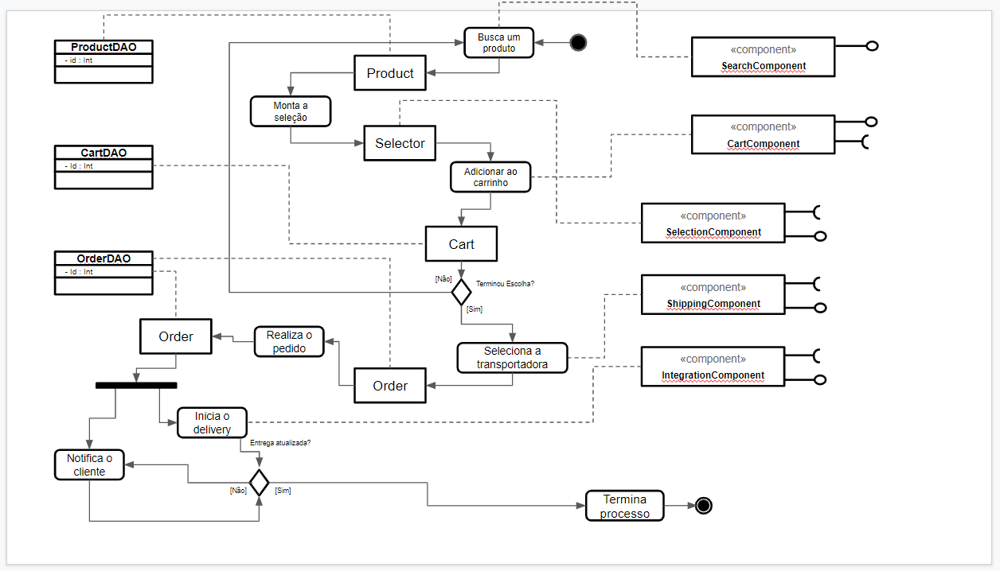
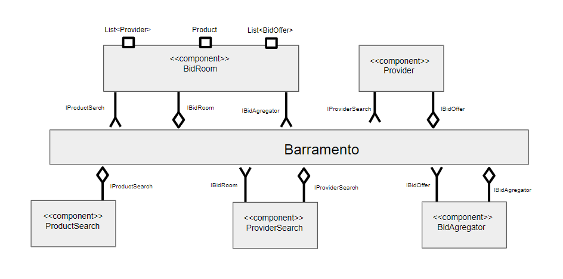

# Apresentação do Lab03 - Model-View-Controller

## Tarefa 1

## Tarefa 2

## Tarefa 3
Captura de telas do aplicativo:  

## App designer!

## App rodando!
### tela 1 - nenhum produto selecionado  

### tela 1 - lista de produtos  
  
### tela 2 - primeiro produto selecionado

### tela 2 - primeiro produto selecionado com quantidade setada

### tela 3 - segundo produto selecionado

### tela 4 - compra de um dos produtos efetivada

### tela 4 - compra de multiplos produtos efetivada

### tela 5 - diagrama de blocos do aplicativo

### Link para o arquivo do aplicativo
[download .aia](app/Tarefa_3.aia)