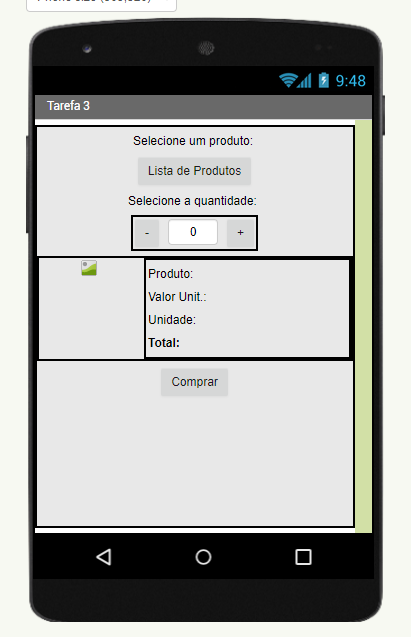
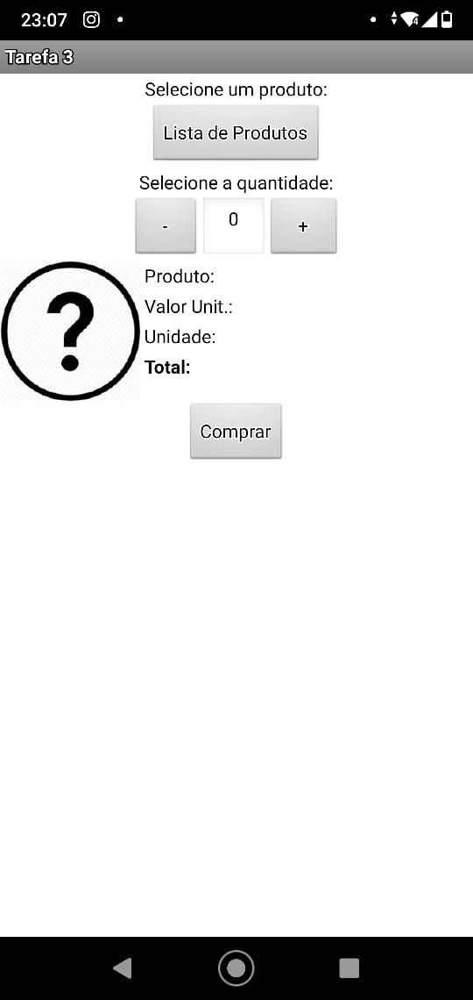
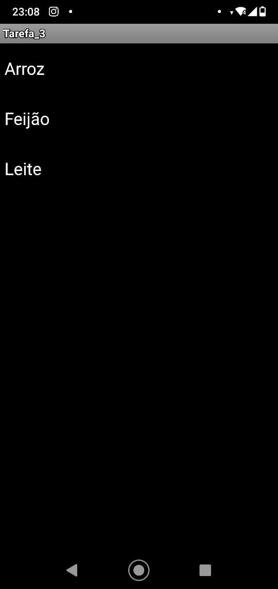
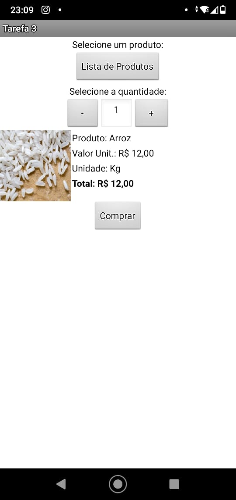
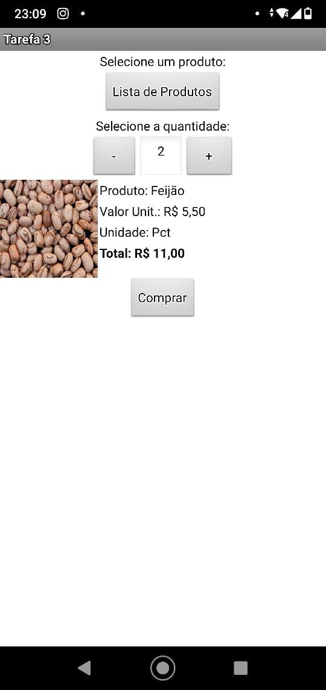
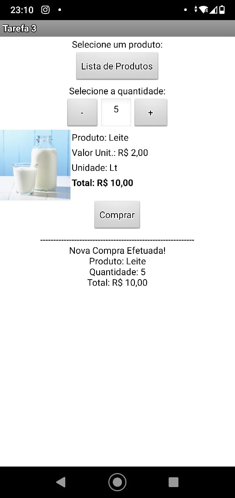
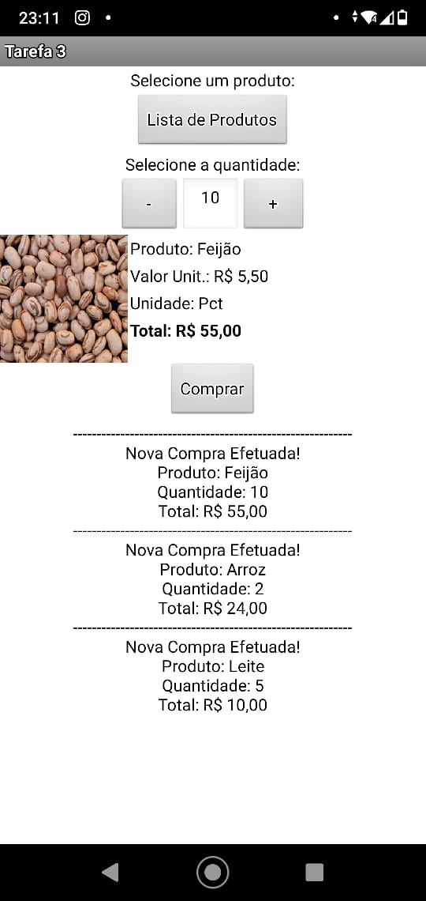
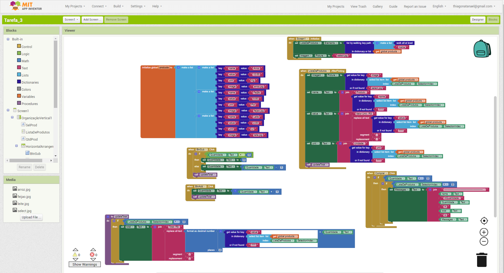

# Apresentação do Lab03 - Model-View-Controller

## Tarefa 1
> Coloque a imagem do PRNG do seu diagrama como ilustrado abaixo:
> 
> 

## Tarefa 2
> Coloque a imagem do PNG do seu diagrama como ilustrado abaixo:
>
> 
>
> Nesta tarefa não há um diagrama de atividades. O leilão é um processo que emerge da interação dos componentes. Liste a seguir qual a sequência esperada de ações que emergirá da interação como uma lista. Quando ser referir a uma mensagem, indique o tópico/interface envolvido. Exemplo:
> 1. o componente X posta uma mensagem com o tópico Y;
> 2. os componentes do tipo A que assinam o tópico X fazem Z e postam uma mensagem com o tópico W.

## Tarefa 3
Captura de telas do aplicativo:  

## App designer!

## App rodando!
### tela 1 - nenhum produto selecionado  

### tela 1 - lista de produtos  
  
### tela 2 - primeiro produto selecionado

### tela 2 - primeiro produto selecionado com quantidade setada

### tela 3 - segundo produto selecionado

### tela 4 - compra de um dos produtos efetivada

### tela 4 - compra de multiplos produtos efetivada

### tela 5 - diagrama de blocos do aplicativo

### Link para o arquivo do aplicativo
[download .aia](app/Tarefa_3.aia)