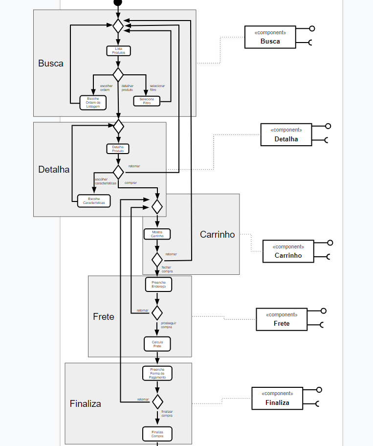
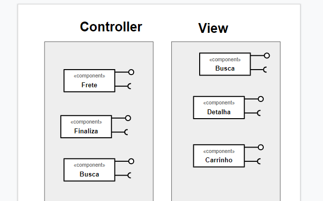
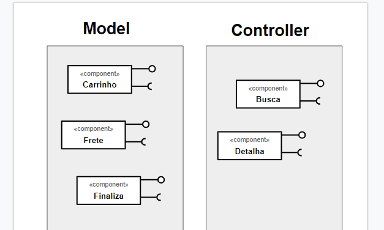

# Apresentação do Lab04 - Serviços

## Tarefa 1

## Tarefa 2

## Tarefa 3

## Tarefa 4

### Serviço 1

* **Título do serviço**: `OMDb API`
* **Breve descrição**:
  Serviço que armazen informações sobre filmes, incluindo avaliações e metadados.  
  O request abaixo retorna informações sobre o filme "Forest Gump"  
* **URL completa da requisição**: `http://www.omdbapi.com/?apikey=f32a6bfe&t=Gump`
* **Cabeçalho HTTP da chamada**:
~~~http
GET /?apikey=f32a6bfe&t=Gump HTTP/1.1
User-Agent: PostmanRuntime/7.26.3
Accept: */*
Postman-Token: 22586522-5c64-4c18-ab30-50792d49845d
Host: www.omdbapi.com
Accept-Encoding: gzip, deflate, br
Connection: keep-alive
Cookie: __cfduid=da39ab7e591b3219daf6a5119a569d0b91598654488
~~~
* **Cabeçalho HTTP da resposta**:
~~~http
HTTP/1.1 200 OK
Date: Fri, 28 Aug 2020 22:46:57 GMT
Content-Type: application/json; charset=utf-8
Transfer-Encoding: chunked
Connection: keep-alive
Cache-Control: public, max-age=86400
Expires: Fri, 28 Aug 2020 23:43:54 GMT
Last-Modified: Fri, 28 Aug 2020 22:43:54 GMT
Vary: *, Accept-Encoding
X-AspNet-Version: 4.0.30319
X-Powered-By: ASP.NET
Access-Control-Allow-Origin: *
CF-Cache-Status: HIT
Age: 183
cf-request-id: 04d8d9bb880000f1e6e024f200000001
Server: cloudflare
CF-RAY: 5ca1923f4d22f1e6-GRU
Content-Encoding: gzip
~~~
* **Conteúdo da resposta**:
~~~json
{
    "Title": "Forrest Gump",
    "Year": "1994",
    "Rated": "PG-13",
    "Released": "06 Jul 1994",
    "Runtime": "142 min",
    "Genre": "Drama, Romance",
    "Director": "Robert Zemeckis",
    "Writer": "Winston Groom (novel), Eric Roth (screenplay)",
    "Actors": "Tom Hanks, Rebecca Williams, Sally Field, Michael Conner Humphreys",
    "Plot": "The presidencies of Kennedy and Johnson, the events of Vietnam, Watergate and other historical events unfold through the perspective of an Alabama man with an IQ of 75, whose only desire is to be reunited with his childhood sweetheart.",
    "Language": "English",
    "Country": "USA",
    "Awards": "Won 6 Oscars. Another 44 wins & 74 nominations.",
    "Poster": "https://m.media-amazon.com/images/M/MV5BNWIwODRlZTUtY2U3ZS00Yzg1LWJhNzYtMmZiYmEyNmU1NjMzXkEyXkFqcGdeQXVyMTQxNzMzNDI@._V1_SX300.jpg",
    "Ratings": [
        {
            "Source": "Internet Movie Database",
            "Value": "8.8/10"
        },
        {
            "Source": "Rotten Tomatoes",
            "Value": "71%"
        },
        {
            "Source": "Metacritic",
            "Value": "82/100"
        }
    ],
    "Metascore": "82",
    "imdbRating": "8.8",
    "imdbVotes": "1,744,491",
    "imdbID": "tt0109830",
    "Type": "movie",
    "DVD": "28 Aug 2001",
    "BoxOffice": "$330,000,000",
    "Production": "Paramount Pictures",
    "Website": "N/A",
    "Response": "True"
}
~~~

### Serviço 2

* **Título do serviço**: `GeoDB Cities`
* **Breve descrição**:
  Serviço de geolocalização aberto com dados interessantes sobre localização, paises e cidades.  
  O Request abaixo retorna cidades próximas de Campinas num raio de 20Km.  
* **URL completa da requisição**: `https://wft-geo-db.p.rapidapi.com/v1/geo/cities/Q171617/nearbyCities?offset=0&limit=10&radius=20`
* **Cabeçalho HTTP da chamada**:
~~~http
GET /v1/geo/cities/Q171617/nearbyCities?offset=0&limit=10&radius=20 HTTP/1.1
x-rapidapi-host: wft-geo-db.p.rapidapi.com
x-rapidapi-key: 27a364f088msh0ac82a2a56cff0ep1071acjsn6543c89e97ca
useQueryString: true
User-Agent: PostmanRuntime/7.26.3
Accept: */*
Postman-Token: 749ef42d-147c-4396-bad7-128804bae0e2
Host: wft-geo-db.p.rapidapi.com
Accept-Encoding: gzip, deflate, br
Connection: keep-alive
~~~
* **Cabeçalho HTTP da resposta**:
~~~http
HTTP/1.1 200 OK
Cache-Control: no-cache, no-store, max-age=0, must-revalidate
content-encoding: gzip
Content-Type: application/json;charset=UTF-8
Date: Fri, 28 Aug 2020 23:19:45 GMT
Expires: 0
Pragma: no-cache
Referrer-Policy: no-referrer
Server: RapidAPI-1.1.24
Vary: Origin
Vary: Access-Control-Request-Method
Vary: Access-Control-Request-Headers
Via: 1.1 google
X-Content-Type-Options: nosniff
X-Frame-Options: DENY
X-RapidAPI-Region: AWS - sa-east-1
X-RapidAPI-Version: 1.1.24
X-RateLimit-requests-Limit: 1000
X-RateLimit-requests-Remaining: 993
X-XSS-Protection: 1 ; mode=block
Content-Length: 666
Connection: keep-alive
~~~
* **Conteúdo da resposta**:
~~~json
{
    "data": [
        {
            "id": 9717,
            "wikiDataId": "Q171617",
            "type": "CITY",
            "city": "Campinas",
            "name": "Campinas",
            "country": "Brazil",
            "countryCode": "BR",
            "region": "São Paulo",
            "regionCode": "SP",
            "latitude": -22.900913888,
            "longitude": -47.057294444,
            "distance": 0.0
        },
        {
            "id": 8339,
            "wikiDataId": "Q983511",
            "type": "CITY",
            "city": "Valinhos",
            "name": "Valinhos",
            "country": "Brazil",
            "countryCode": "BR",
            "region": "São Paulo",
            "regionCode": "SP",
            "latitude": -22.970833333,
            "longitude": -46.995833333,
            "distance": 6.22
        },
        {
            "id": 138367,
            "wikiDataId": "Q983534",
            "type": "CITY",
            "city": "Vinhedo",
            "name": "Vinhedo",
            "country": "Brazil",
            "countryCode": "BR",
            "region": "São Paulo",
            "regionCode": "SP",
            "latitude": -23.03,
            "longitude": -46.975,
            "distance": 10.34
        },
        {
            "id": 9852,
            "wikiDataId": "Q952617",
            "type": "CITY",
            "city": "Hortolândia",
            "name": "Hortolândia",
            "country": "Brazil",
            "countryCode": "BR",
            "region": "São Paulo",
            "regionCode": "SP",
            "latitude": -22.85833,
            "longitude": -47.22,
            "distance": 10.77
        },
        {
            "id": 8667,
            "wikiDataId": "Q40706",
            "type": "CITY",
            "city": "Paulínia",
            "name": "Paulínia",
            "country": "Brazil",
            "countryCode": "BR",
            "region": "São Paulo",
            "regionCode": "SP",
            "latitude": -22.76111,
            "longitude": -47.15417,
            "distance": 11.46
        },
        {
            "id": 9368,
            "wikiDataId": "Q1645067",
            "type": "CITY",
            "city": "Jaguariúna",
            "name": "Jaguariúna",
            "country": "Brazil",
            "countryCode": "BR",
            "region": "São Paulo",
            "regionCode": "SP",
            "latitude": -22.70556,
            "longitude": -46.98583,
            "distance": 14.24
        },
        {
            "id": 8433,
            "wikiDataId": "Q942135",
            "type": "CITY",
            "city": "Sumaré",
            "name": "Sumaré",
            "country": "Brazil",
            "countryCode": "BR",
            "region": "São Paulo",
            "regionCode": "SP",
            "latitude": -22.82194,
            "longitude": -47.26694,
            "distance": 14.42
        },
        {
            "id": 8501,
            "wikiDataId": "Q786140",
            "type": "CITY",
            "city": "Pedreira, São Paulo",
            "name": "Pedreira, São Paulo",
            "country": "Brazil",
            "countryCode": "BR",
            "region": "São Paulo",
            "regionCode": "SP",
            "latitude": -22.74194,
            "longitude": -46.90139,
            "distance": 14.81
        },
        {
            "id": 138379,
            "wikiDataId": "Q1795673",
            "type": "CITY",
            "city": "Louveira",
            "name": "Louveira",
            "country": "Brazil",
            "countryCode": "BR",
            "region": "São Paulo",
            "regionCode": "SP",
            "latitude": -23.08252,
            "longitude": -46.93308,
            "distance": 14.83
        },
        {
            "id": 9507,
            "wikiDataId": "Q773065",
            "type": "CITY",
            "city": "Itatiba",
            "name": "Itatiba",
            "country": "Brazil",
            "countryCode": "BR",
            "region": "São Paulo",
            "regionCode": "SP",
            "latitude": -23.00583,
            "longitude": -46.83889,
            "distance": 15.67
        }
    ],
    "links": [
        {
            "rel": "first",
            "href": "/v1/geo/cities/Q171617/nearbyCities?offset=0&limit=10&radius=20"
        },
        {
            "rel": "next",
            "href": "/v1/geo/cities/Q171617/nearbyCities?offset=10&limit=10&radius=20"
        },
        {
            "rel": "last",
            "href": "/v1/geo/cities/Q171617/nearbyCities?offset=0&limit=10&radius=20"
        }
    ],
    "metadata": {
        "currentOffset": 0,
        "totalCount": 17
    }
}
~~~