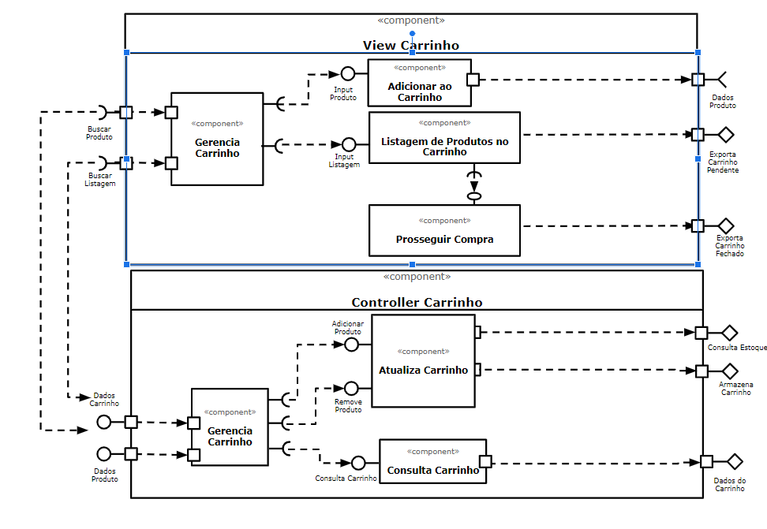

# Apresentação do Lab04 - Serviços

## Tarefa 1


## Tarefa 2
https://codepen.io/tnatanael/pen/zYqPwNX

```html
<div id="root"></div>
```

```javascript
class Barra extends React.Component {
    constructor(props) {
      super(props);
      this.state = {
        tamanho: props.tamanho
      }
    }
  aumentarTamanho= () => {
    this.setState({
      tamanho: this.state.tamanho+1
    }); 
  }
  diminuirTamanho= () => {
    this.setState({
      tamanho: this.state.tamanho-1
    }); 
  }
  render() {
    let resultado = "";
    for (let b = 1; b <= this.state.tamanho; b++)
      resultado += "=";
    
    return (
      <div>
        <span>{resultado}</span>
        <br />
        <button onClick={this.aumentarTamanho}>Aumentar</button>
        <button onClick={this.diminuirTamanho}>Diminuir</button>
        <h2>Clique para aumentar ou diminuir</h2>
      </div>
    );
  }
}

class ChuckNorris extends React.Component {
    constructor(props) {
      super(props);
      this.state = {
        mensagem: ""
      }
    }
  mudarMensagem= () => {
    let xhttp = new XMLHttpRequest();
    xhttp.open("GET", "https://api.icndb.com/jokes/random", false);
    xhttp.send();
    let mensagem = JSON.parse(xhttp.responseText);
    this.setState({
      mensagem: mensagem.value.joke
    }); 
  }
  render() {
    return (
      <div>
        <h2>Mensagens sobre Chuck Norris!</h2>
        {this.state.mensagem}
        <br />
        <br />
        <button onClick={this.mudarMensagem}>Mudar Mensagem!</button>
      </div>
    );
  }
}

const elemento = <div>
                   <h2>Barra dinâmica!</h2>
                   <Barra tamanho={10}/>
                   <ChuckNorris />
                 </div>
ReactDOM.render(elemento, document.getElementById("root"));

```
